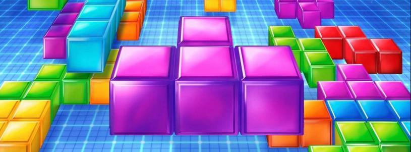
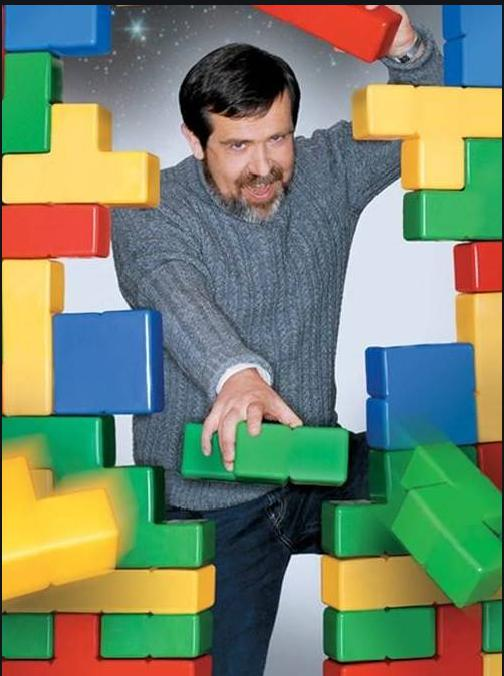
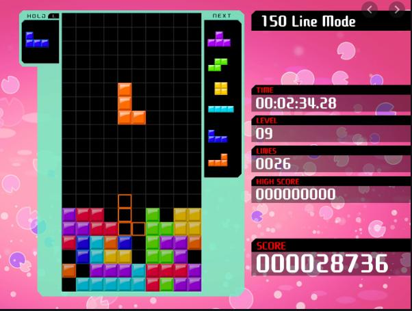
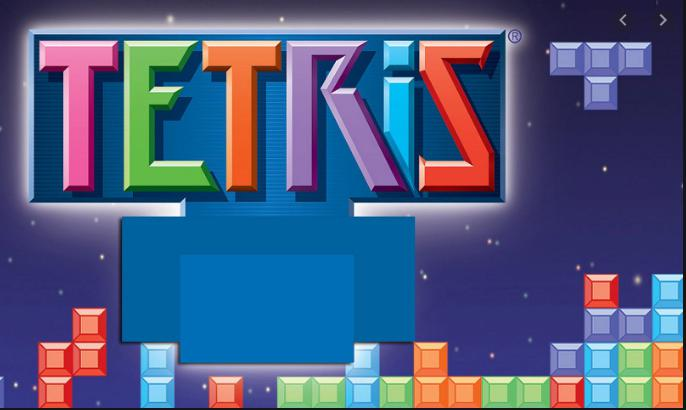
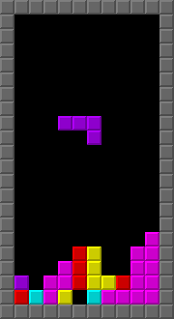

# สวัสดีครับกลุ่มของเราได้ทำโปรเจ็คเกี่ยวกับการสร้างเกมส์และสามารถทำงานได้จริง เล่นได้จริง
# Project Computer Programing
โครงงานนี้จัดทำขึ้นในรายวิชา Computer Programing โดยการใช้ภาษา C ในการพัฒนาโปรแกรมเกมส์ Tetris และออกแบบกราฟฟิกตัวเกมขึ้นมาใหม่่
link youtube:

# Tetris
เป็นเกมส์แก้ปัญหาจัดเรียงบล็อกที่หล่นลงมา จัดเรียงให้เป็นแถวแนวเดียวกัน TeTris เป็นเกมที่นิยมอย่างมากเกมหนึ่งในสมัยก่อน โดยมีการนำมาสร้างใหม่หลายครั้ง

# Image
||

# creator
ตัวเกมออกแบบโดยอะเลคเซย์ ปายีตนอฟ (Alexey Pajitnov) 
นักออกแบบเกมชาวรัสเซียออกแบบสำหรับเล่นในเครื่อง Electronika 60 ไว้เมื่อวันที่ 6 มิถุนายน พ.ศ. 2527

||

# History
ชื่อเกมนั้นผู้ออกแบบได้นำคำศัพท์จากเลขกรีก คำว่า "เตตระ-" ที่หมายถึง 4 เนื่องจากชิ้นส่วนของตัวบล็อกแต่ละตัวนั้นจะประกอบด้วย 4 ชิ้นส่วน เกมเตตริสนั้นเป็นหนึ่งในเกมที่มีการนำมาทำซ้ำมากที่สุดในโลกเกมหนึ่งไม่ว่าเครื่องเล่นวิดีโอเกม เครื่องเล่นเกมแบบพกพา เกมคอมพิวเตอร์ เกมบนโทรศัพท์มือถือ และอื่น ๆ อีกมาก

# ตัวอย่างการถูกมาสร้างและปรับกราฟฟิกให้ทันสมัย

||
||

# How To Use
Download ไฟล์เกมที่ลิ้งค์ https://raw.githubusercontent.com/siwawong12/ComPro_TeTris/master/Project2/Project2.rar
และ กดรันตัวเกมที่ x64/debug/project2.exe

# How To Play
จะมีบลอครูปทรงต่างๆ ที่ประกอบด้วยบล็อคย่อย 4 บล็อค ซึ่งรูปทรงนี้ เรียกว่า Tetrads รูปทรงเหล่านี้จะร่วงลงมา และเมื่อเราสามารถเติมเต็มได้ในหนึ่งแถว แถวนั้นจะหายไป การทำให้หายไปนี้ สามารถหายไป พร้อมกันมากที่สุดได้ 4 แถวโดยบลอครูปตัว I และการทำให้หายไป มากที่สุด 4 แถวนี้แหละ ที่เรียกว่า Tetris และเป็นชื่อเกมTetris เป็นเกมที่ใช้หลักแรงโน้มถ่วงของโลก ซึ่งเป็นเหตุทำให้กติกา ในยุคแรก กับในยุคหลัง ต่างกัน กรุณาดูตามรูปกติกาในยุคแรกนั้น เราจะไม่สามารถทำ คอมโบต่อเนื่อง ได้ กล่าวคือ เมื่อแถวปัจจุบันหายไป แถวข้างบน จะหล่นลงมา เพียงครั้งเดียวเท่านั้น

||
